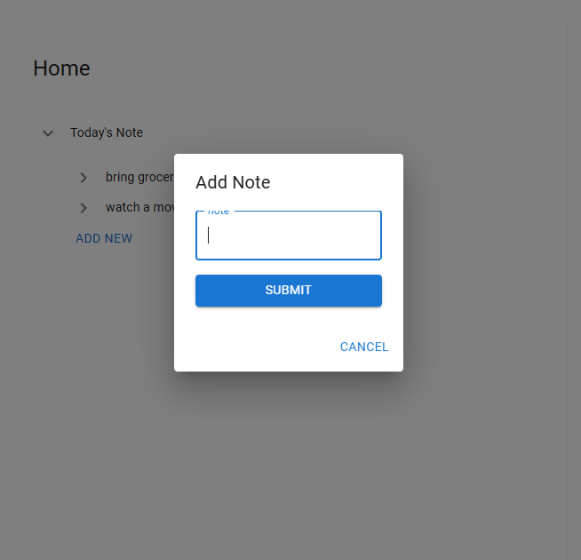

# 🚀 Project Name

Life Manager (Todo App)

---

## 📸 Screenshots

### 🏠 Home Page


### 💬 Life Manager / Main Feature



> Place your images inside `docs/images/` folder

---

## 🧰 Tech Stack

- ⚛️ React (TypeScript)
- 🎨 Tailwind CSS / Material UI
- 🔌 Axios
- 🔄 State Management (Context API)

---

## 📂 Project Structure

```
src/
├── assets/        # Images, icons, static files
├── components/    # Reusable UI components
├── features/      # Page-level components
├── hooks/         # Custom hooks
├── api/           # API calls
├── mocks/         # Mock API calls
├── routes/        # Routes
├── i18n/          # Translations
├── App.tsx
└── main.tsx
```

---

## ⚙️ Installation & Setup

```bash
# Clone the repo
git clone <repo-url>

# Navigate to project
cd app-name

# Install dependencies
npm install

# Start development server
npm run dev
```

---

## 🌐 Environment Variables

Create a `.env` file in root:

```
VITE_APP_NAME=LifeManagerApp
VITE_MOCK_API_ON=false
VITE_BACKEND_SERVER=http://localhost:3000
VITE_API_BASE_URL=/api


```

---

## ✨ Features

- 🔐 Authentication (Login / Logout)
- 💬 Manage todo list
- 📱 Responsive design
- 🌙 Dark / Light mode
- ⚡ Fast and optimized performance
- 💬 English and Hindi language support

---

## 🧪 Testing

```bash
npm run test
```

---

## 📦 Build

```bash
npm run build
```

## 📄 License

This project is licensed under the MIT License.

---

## 👨‍💻 Author

Bijoy Paitandi

- GitHub: https://github.com/viizz29
- LinkedIn: https://www.linkedin.com/in/viizz29
